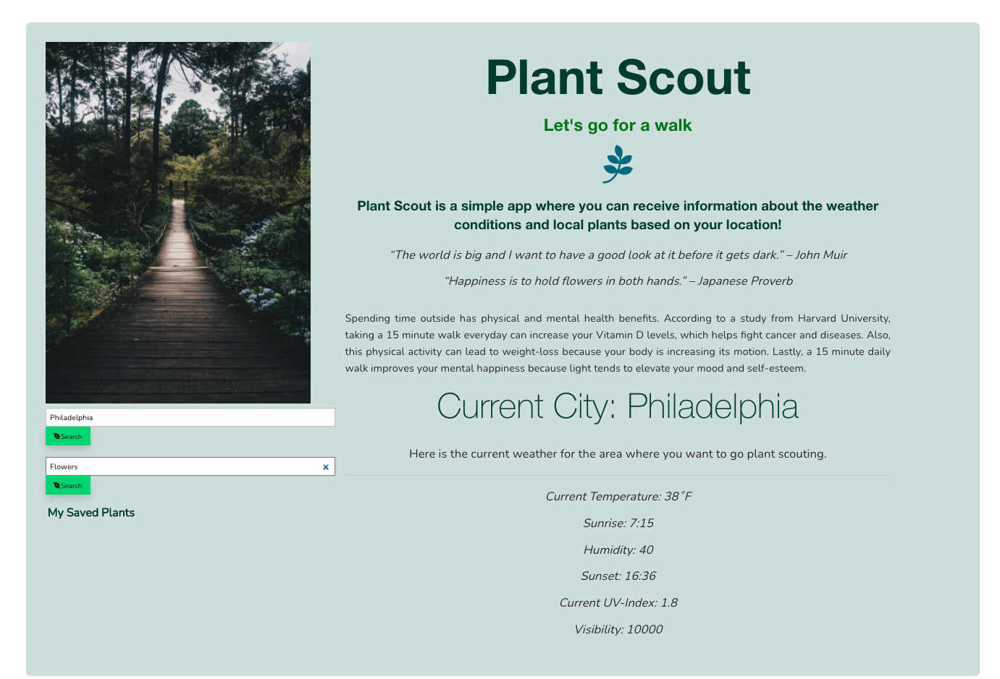
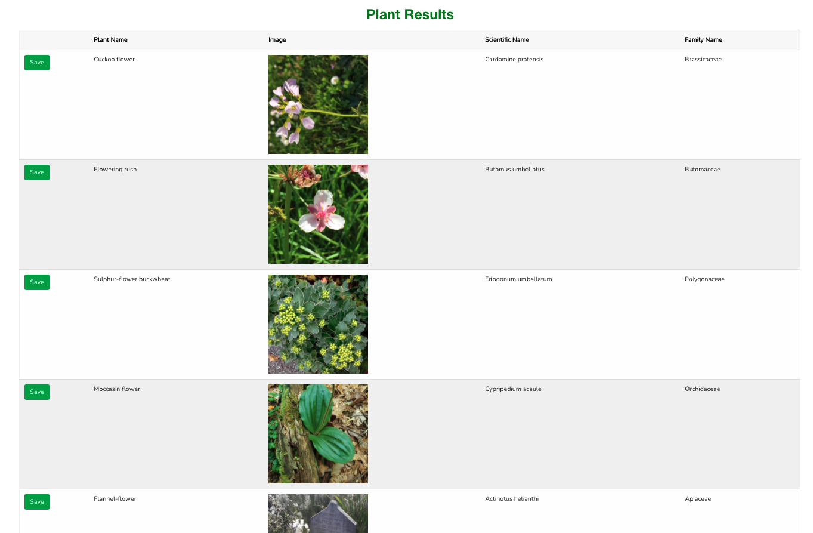

# Project One - Plant Scout

Create a web application that will retrieve, display, and save weather data for cities and plant data using HTML, CSS, Javascript, and jQuery.

Deployment Link: https://karajsch.github.io/plant-scout/

<!-- TABLE OF CONTENTS -->

  
Table of Contents

  <ol>
    <li>
      <a href="about-the-project">About The Project</a>
      <ul>
        <li><a href="built-with">Built With</a></li>
      </ul>
    </li>
    <li><a href="getting-started">Getting Started</a></li>
    <li><a href="contributing">Contributing</a></li>
    <li><a href="liscense">Liscensing</a></li>
    <li><a href="contact">Contact</a></li>
  </ol>

# About The Project
The name of our app is called Plant Scout. The purpose of this project was to create an application within the web browser that would retrieve, display, and save weather data for cities. It also retrieves, displays, and saves data of plants. Plant Scout is ideal for anyone who wants to know their local weather conditions and information about plants. We used two Application Programming Interfaces (API's) in this project. The first was Open Weather Map, which is a weather API that contains data of weather conditions in over 200,000 cities. And the second was Trefle, which is a botanical API and database that contains information about plants all over the world. When the user enters in their city, Plant Scout displays the current forecast for the day, which includes the temperature, humidity, UV index, visibility, sunrise, and sunset. When the user enters in the type of plant they are interested in, Plant Scout displays a list of various plants within their search category. It displays the plant's common, scientific, and family name as well as a picture of the plant. 

### Built With
The code quiz web application was created with these coding languages:
* HMTL
* CSS
* JavaScript
* jQuery

It was also built with the Open Weather Map API

# Contributing
1. Fork it!
2. Create your feature branch: `git checkout -b my-new-feature`
3. Commit your changes: `git commit -am 'Add some feature'`
4. Push to the branch: `git push origin my-new-feature`
5. Submit a pull request

# Liscensing
Permission is hereby granted, free of charge, to any person obtaining a copy of this software and associated documentation files (the "Software"), to deal in the Software without restriction, including without limitation the rights to use, copy, modify, merge, publish, distribute, sublicense, and/or sell copies of the Software, and to permit persons to whom the Software is furnished to do so, subject to the following conditions:

The above copyright notice and this permission notice shall be included in all copies or substantial portions of the Software.

THE SOFTWARE IS PROVIDED "AS IS", WITHOUT WARRANTY OF ANY KIND, EXPRESS OR IMPLIED, INCLUDING BUT NOT LIMITED TO THE WARRANTIES OF MERCHANTABILITY, FITNESS FOR A PARTICULAR PURPOSE AND NONINFRINGEMENT. IN NO EVENT SHALL THE AUTHORS OR COPYRIGHT HOLDERS BE LIABLE FOR ANY CLAIM, DAMAGES OR OTHER LIABILITY, WHETHER IN AN ACTION OF CONTRACT, TORT OR OTHERWISE, ARISING FROM, OUT OF OR IN CONNECTION WITH THE SOFTWARE OR THE USE OR OTHER DEALINGS IN THE SOFTWARE.

# Contact
Github Link: https://github.com/karajsch/plant-scout

reg Leighton - https://github.com/preussenfahrer

Kara Schmidt - https://github.com/karajsch

Tamira Bell - https://github.com/tbell-woG
